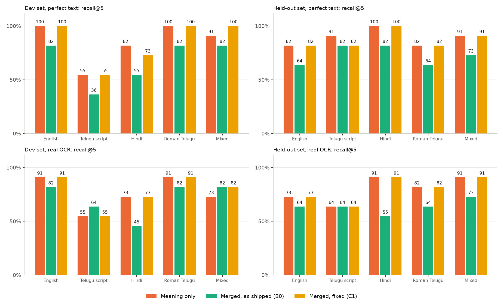
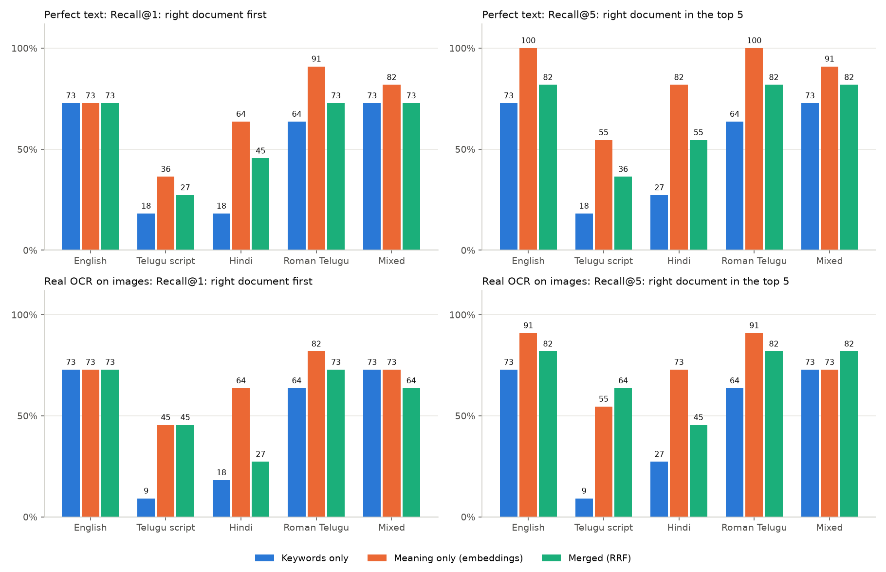

# Munin evaluation

How well does Munin find the right screenshot, answer value questions, and add up payments, measured on a labelled test set
instead of a few hand-picked queries. **The first honest result is that it is weaker than the demo queries suggested**, and
the headline claim "merging keyword and meaning search beats either alone" does **not** hold on this set.

> The sections from "What was measured" to "How far to trust this" describe the **original, untuned behaviour** (the baseline).
> Two fixes were developed afterwards and checked on a separate held-out set: see **Fix experiments** below, which also says what
> now ships. Re-running `tools/eval/run_eval.sh` regenerates the tables and charts but not the hand-written commentary.

## What was measured

- **Corpus:** 300 synthetic documents: 243 English, 32 Hindi, 25 Telugu. 49 fee receipt, 46 upi payment, 45 ticket, 40 utility bill, 34 notes, 26 appointment, 14 timetable, 13 chat, 8 rent receipt, 8 insurance, 7 shopping list, 6 certificate, 4 recipe. Eleven "anchor" documents are the single correct answer for the queries; the other 289 are fillers of the
  *same types* (other hostels, flights, bills, notes ...), so every query has many confusable near-misses. A script asserts that
  words specific to an anchor appear in no other document, so each query has exactly one correct document.
- **Queries:** 60 = 11 intents x 5 styles (English, Telugu script, Hindi, Roman-script Telugu, mixed) + 5 "no such document"
  questions. The same 11 intents are phrased in all five styles, so styles are directly comparable. 25 of the 55 find/value
  queries ask for a value (amount, date, phone). Anchors are in English (8), Hindi (2) and Telugu (1) documents.
- **Two modes:** *perfect text* indexes each document's true text (isolates retrieval and extraction from OCR); *real OCR* renders
  every document to a PNG and runs the real ML Kit pipeline, so it includes OCR mistakes and Telugu text that OCR cannot read.
- **Configurations:** keywords only (BM25), meaning only (embeddings), merged (reciprocal rank fusion), as in the app.
- **Metrics:** recall@1, recall@5, MRR (rank of the correct document, 1/rank, 0 if outside the top 20); value-question accuracy;
  field extraction; ledger totals against the true sums; latency (emulator).

## Headline

| Mode | Configuration | Recall@1 | Recall@5 | MRR | Median search time |
|---|---:|---:|---:|---:|---:|
| Perfect text | Keywords only | 49% | 51% | 0.50 | 5 ms |
| Perfect text | Meaning only (embeddings) | 69% | 85% | 0.77 | 19 ms |
| Perfect text | Merged (RRF) | 58% | 67% | 0.62 | 20 ms |
| Real OCR | Keywords only | 47% | 49% | 0.48 | 5 ms |
| Real OCR | Meaning only (embeddings) | 67% | 76% | 0.71 | 20 ms |
| Real OCR | Merged (RRF) | 56% | 71% | 0.63 | 20 ms |

| Mode | Value questions | Wrongly answered when no document exists | Document fields extracted (truth present) | Ledger |
|---|---:|---:|---:|---:|
| Perfect text | 10 / 25 correct (3 wrong shown) | 2 / 5 | 377 / 377 | 35 of 35 counted, 0 wrong amounts |
| Real OCR | 9 / 25 correct (0 wrong shown) | 2 / 5 | 317 / 377 | 20 of 35 counted, 0 wrong amounts |

## Findings

1. **Merged is worse than meaning-only overall, in both modes** (recall@5 67% vs 85% with perfect text; 71% vs 76% with real OCR),
   but the picture is more specific than that. **When the query and the document are in the same language, merged is as good or
   slightly better**: for English, Roman-script Telugu and mixed queries over the 8 English-document intents, merged ranked the
   right document first in 24 of 24 queries (23 of 24 with OCR) against 22 of 24 for meaning-only. **Across languages it hurts**:
   Hindi queries (recall@5 55% vs 82% with perfect text), and every query aimed at a Hindi or Telugu document from another script
   (Hindi documents: 60% vs 90%; Telugu documents: 40% vs 100% with perfect text). For Telugu-script queries the two are within
   noise (n=11) and the winner flips between modes. Reading the actual rankings shows why: in those cases the keyword leg returns
   *lexical coincidences*: Hindi function words (a Hindi question about an English receipt returned unrelated Hindi notes), the shared
   word "Vidya" (an English query for the Hindi *Saraswati Vidya Mandir* receipt returned the English *Sai Vidya Hostel* receipt), and
   the Telugu word for "bill" (a Telugu water-bill query returned Telugu electricity bills). Rank-based fusion trusts a rank-1
   keyword hit as much as a rank-1 meaning hit, and there are no Hindi or Telugu stopword lists. A coverage gate on the keyword leg
   fixed most of this; see Fix experiments.
2. **Language matters a lot.** English, Roman-script Telugu and mixed queries over English documents land the right document first
   almost every time (see the per-intent table). Telugu-script and Hindi queries over English documents mostly do not. The embedding
   model finds the *topic* across languages but not *names and dates* across scripts, which is exactly what tells ten similar bills
   or receipts apart.
3. **Telugu text in images is not read, as designed.** With real OCR, Telugu documents are found 0 of 5 times and only 4 of 46
   fields in them were extracted (9%), against 96% for English and 89% for Hindi documents. A Tesseract fallback is the only fix.
4. **Value answers are far from reliable.** Only 10 of 25 (perfect text) and 9 of 25 (real OCR) value questions were answered
   correctly. With perfect text, 3 wrong answers were shown (all Telugu-script queries, answered from the wrong receipt); with real
   OCR none were wrong because the app declined 15 times. Worse, **2 of the 5 "no such document" questions got a confident answer**
   ("how much was the car insurance" -> a *health* insurance premium), because the whole-word gate accepts "insurance" as half of the
   question's topic. The gate needs to require the *distinguishing* words, not any overlap.
5. **Extraction is exact on clean text and good but not great on OCR.** 377 of 377 truth values were present with perfect text.
   With OCR: amounts 80%, dates 84%, phones 96%, addresses 100%; 42 of the 60 misses are in the Telugu documents (4 of 46 fields found), the other 18 are OCR errors in English (12) and Hindi (6) documents.
6. **The ledger is exact about what it counts but counts only part of it.** With perfect text all 35 distinct payments were counted
   and every monthly total matched to the paisa. With real OCR, 20 of the 35 were counted, **0 counted amounts were wrong**, every
   monthly total equalled the true sum of the payments counted, and 14 payments were held back as "needs a check" because OCR read
   the rupee sign as a different glyph (the amounts themselves were read correctly for all 46). The guard trades coverage for safety.
7. **Speed is not a problem:** search takes a median of 2-19 ms on the emulator (the model's query embedding dominates); OCR a median
   92 ms and embedding 32 ms per document.

## How far to trust this

- **The documents are synthetic and template-generated**: clean, regular and repetitive. Real screenshots are messier, so real
  accuracy is likely lower on extraction and the ledger, and unknown on retrieval.
- **Small test set:** 55 find/value queries, 11 per style, so one query is 9 percentage points within a style; differences under
  about 10 points are noise. The 11 intents are not independent samples (each appears in all five styles).
- **Queries in Telugu, Hindi, Roman Telugu and mixed were written by the author, not a native speaker.** Awkward phrasing would
  lower those styles' scores; they need a native review before the numbers are quoted.
- One correct document per query; near-duplicate answers are not credited.
- Latency is from an emulator, not a phone. OCR output varies slightly between runs.
- Not done: comparison with a second embedding model, and a held-out query set. Because there is no held-out set, **any tuning
  against these 60 queries would make its results optimistic** and should be re-measured on fresh queries.

## What to try next (not done)

1. Stop the answer gate treating generic words as topic words: apply the Hindi/Telugu stopword lists and a small list of generic verbs
   ("pay", "spend", "cost") when extracting a question's topic. This should win back correct answers without bringing back wrong ones, but
   it changes behaviour that was just measured, so it needs a *new* held-out set.
2. Score-aware fusion: merged currently only ties meaning-only, so the keyword leg is not yet earning its place beyond same-language names.
3. Add a Tesseract Telugu pass behind the `OcrEngine` interface and measure it with this harness (Telugu documents are currently 0%).
4. Get the non-English queries reviewed by native speakers and build a third, independently written query set.

## Reproduce

```sh
tools/eval/run_eval.sh                       # dev set, perfect-text and real-OCR modes, on a connected device or emulator (about 2 minutes)
tools/eval/run_eval.sh oracle,image heldout  # the held-out set (build it with: python tools/eval/make_corpus.py heldout)
tools/eval/run_eval.sh oracle                # perfect-text mode only (about 30 seconds, no images needed)
```

`make_corpus.py` builds `tools/eval/data/` (committed), `render_images.swift` renders the PNGs (not committed, macOS only),
`EvalHarnessTest` runs the pipeline on the device and writes raw results to `tools/eval/results/` (committed), and `report.py`
computes every metric from those raw results.


## Fix experiments: dev set, selection, then a held-out check

The baseline above exposed two problems, so two fixes were tried. To keep this honest the procedure was fixed **before** any number
from the second set existed:

1. A second, **held-out** corpus was generated first: 300 new documents (new seed) and 60 new queries built around 11 *new* intents
   (rent at Gokul Residency, train to Madurai, an insurance premium date, TCP notes, a dentist's phone, a payment to Kamat Medical
   Store, a gongura recipe, a Hindi electricity bill, Hindi chemistry notes, a Telugu dental appointment, Vijayanagara notes) plus 5
   "no such document" questions ("bike insurance"). The original 300 documents / 60 queries became the **dev** set (their content is
   unchanged).
2. **Five retrieval variants and two answer gates were declared up front**, each switchable through `SearchOptions` / `AnswerOptions`
   (B0 = shipped behaviour; S1 = stopwords; C1 = coverage gate; S2 = both; S3 = both plus a keyword weight of 0.5; A1 = grounding).
3. A **selection rule was written into `report.py` before the held-out run**: the retrieval variant with the highest mean merged MRR on the
   dev set (over perfect text and real OCR) that does not lose more than one same-language rank-1 versus B0; the answer gate with the fewest
   wrong plus made-up answers, ties to more correct answers.
4. The held-out set was then measured once, for all variants, and the app now ships the dev-selected ones.

**Selected on the dev set by the pre-declared rule: retrieval variant C1 (+ keyword coverage gate (>= half the query words)), answer gate A1 (+ grounding (every rare question word must be in the document)).**



### What the experiment showed

1. **The coverage gate is the fix that works, and it replicated on new data.** It requires a keyword hit to match at least half of the
   query's content words, so a lone shared word ("Vidya", "bill") or a Hindi particle no longer counts as a match. Held-out merged recall@5
   went from 73% to 87% with perfect text and from 64% to 80% with real OCR; across-language recall@5 from 50% to 77% and from 40% to 70%;
   same-language queries stayed at 100% / 92%. Stopwords alone helped less (+3 and +7 recall@5 points) and added nothing once the coverage
   gate was on; down-weighting the keyword list was no better than the gate.
2. **Merged still does not clearly beat meaning-only.** After the fix it is level with it. Perfect text: on the dev set merged is ahead at
   recall@1 (73% vs 69%) and MRR (0.79 vs 0.77) and tied at recall@5 (85%); on the held-out set meaning-only is ahead (recall@5 89% vs 87%,
   MRR 0.87 vs 0.84). Real OCR: a tie on the held-out set (65% / 80% / 0.70 for both) and merged marginally ahead on dev (MRR 0.72 vs 0.71).
   The honest summary is "merged is now about as good as meaning-only", not "better than either alone".
3. **The grounding gate removes every wrong and made-up answer, at a real cost in answers.** Held-out: wrong answers 1 -> 0, made-up answers
   to "bike insurance" 2 of 5 -> 0 of 5 (dev: 3 -> 0 and 2 -> 0). But correct answers fell from 10 to 6 of 25 (perfect text) and 8 to 5
   (real OCR), and on dev from 10 to 7 and 9 to 6. The cost has a known cause: the gate treats any question word that is rare in the
   collection and absent from the document as a missing topic, and it cannot tell a generic word from a topic word, e.g. "pay" when the
   receipt says "paid", Hindi "था", or the Telugu verb "కట్టాను". It is shipped exactly as measured so the numbers describe the app.

### Caveats specific to this experiment

- Dev and held-out were built by the same author with the same templates and the same query phrasing patterns, so the held-out set is
  *fresh* but not fully *independent*; and the held-out negative ("bike insurance") is deliberately the same trap as the dev one
  ("car insurance"), so it checks the fix more than it discovers new failures.
- Both sets are synthetic, small (one query is about 9 points within a style) and the non-English wording is unreviewed by native speakers.
- All five variants were also measured on the held-out set (shown above) for transparency, but only the dev-selected one was acted on; had
  a different variant been picked after looking, the held-out result would no longer be independent.

#### Dev set: every pre-declared variant

**Perfect text**

| Variant | Merged R@1 / R@5 / MRR | Same-language (27) R@1 / R@5 | Cross-language (28) R@1 / R@5 | Keywords-only R@1 / R@5 | Answers, gate A0: correct / wrong / false-on-no-answer | Answers, gate A1 (grounding): correct / wrong / false-on-no-answer |
|---|---:|---:|---:|---:|---:|---:|
| B0: baseline (as shipped) | 58% / 67% / 0.62 | 100% / 100% | 18% / 36% | 49% / 51% | 10 / 3 / 2 | 7 / 0 / 0 |
| S1: + Hindi/Telugu/Roman stopwords | 58% / 67% / 0.62 | 100% / 100% | 18% / 36% | 51% / 51% | 10 / 3 / 2 | 7 / 0 / 0 |
| C1: + keyword coverage gate (>= half the query words) **(selected on dev)** | 73% / 85% / 0.79 | 100% / 100% | 46% / 71% | 47% / 47% | 10 / 3 / 1 | 7 / 0 / 0 |
| S2: stopwords + coverage gate | 73% / 84% / 0.78 | 100% / 100% | 46% / 68% | 47% / 47% | 10 / 3 / 2 | 7 / 0 / 0 |
| S3: stopwords + coverage gate + keyword weight 0.5 | 71% / 84% / 0.77 | 96% / 100% | 46% / 68% | 47% / 47% | 10 / 3 / 2 | 7 / 0 / 0 |
| Meaning only (reference, unchanged) | 69% / 85% / 0.77 |  |  |  |  |  |

**Real OCR**

| Variant | Merged R@1 / R@5 / MRR | Same-language (27) R@1 / R@5 | Cross-language (28) R@1 / R@5 | Keywords-only R@1 / R@5 | Answers, gate A0: correct / wrong / false-on-no-answer | Answers, gate A1 (grounding): correct / wrong / false-on-no-answer |
|---|---:|---:|---:|---:|---:|---:|
| B0: baseline (as shipped) | 56% / 71% / 0.63 | 93% / 96% | 21% / 46% | 47% / 49% | 9 / 0 / 2 | 6 / 0 / 0 |
| S1: + Hindi/Telugu/Roman stopwords | 58% / 73% / 0.64 | 93% / 96% | 25% / 50% | 49% / 49% | 9 / 0 / 2 | 6 / 0 / 0 |
| C1: + keyword coverage gate (>= half the query words) **(selected on dev)** | 67% / 78% / 0.72 | 93% / 96% | 43% / 61% | 45% / 45% | 9 / 0 / 2 | 6 / 0 / 0 |
| S2: stopwords + coverage gate | 67% / 78% / 0.72 | 93% / 96% | 43% / 61% | 45% / 45% | 9 / 0 / 2 | 6 / 0 / 0 |
| S3: stopwords + coverage gate + keyword weight 0.5 | 67% / 78% / 0.72 | 93% / 96% | 43% / 61% | 45% / 45% | 9 / 0 / 2 | 6 / 0 / 0 |
| Meaning only (reference, unchanged) | 67% / 76% / 0.71 |  |  |  |  |  |

#### Held-out set: measured once, after the selection above (selected variant flagged)

**Perfect text**

| Variant | Merged R@1 / R@5 / MRR | Same-language (25) R@1 / R@5 | Cross-language (30) R@1 / R@5 | Keywords-only R@1 / R@5 | Answers, gate A0: correct / wrong / false-on-no-answer | Answers, gate A1 (grounding): correct / wrong / false-on-no-answer |
|---|---:|---:|---:|---:|---:|---:|
| B0: baseline (as shipped) | 62% / 73% / 0.67 | 100% / 100% | 30% / 50% | 47% / 47% | 10 / 1 / 2 | 6 / 0 / 0 |
| S1: + Hindi/Telugu/Roman stopwords | 69% / 76% / 0.72 | 100% / 100% | 43% / 57% | 47% / 47% | 10 / 1 / 2 | 6 / 0 / 0 |
| C1: + keyword coverage gate (>= half the query words) **(selected on dev)** | 82% / 87% / 0.84 | 100% / 100% | 67% / 77% | 45% / 45% | 10 / 1 / 2 | 6 / 0 / 0 |
| S2: stopwords + coverage gate | 80% / 87% / 0.83 | 100% / 100% | 63% / 77% | 45% / 45% | 10 / 1 / 2 | 6 / 0 / 0 |
| S3: stopwords + coverage gate + keyword weight 0.5 | 80% / 87% / 0.83 | 100% / 100% | 63% / 77% | 45% / 45% | 10 / 1 / 2 | 6 / 0 / 0 |
| Meaning only (reference, unchanged) | 85% / 89% / 0.87 |  |  |  |  |  |

**Real OCR**

| Variant | Merged R@1 / R@5 / MRR | Same-language (25) R@1 / R@5 | Cross-language (30) R@1 / R@5 | Keywords-only R@1 / R@5 | Answers, gate A0: correct / wrong / false-on-no-answer | Answers, gate A1 (grounding): correct / wrong / false-on-no-answer |
|---|---:|---:|---:|---:|---:|---:|
| B0: baseline (as shipped) | 56% / 64% / 0.61 | 92% / 92% | 27% / 40% | 44% / 44% | 8 / 1 / 2 | 5 / 0 / 0 |
| S1: + Hindi/Telugu/Roman stopwords | 62% / 71% / 0.66 | 92% / 92% | 37% / 53% | 44% / 44% | 8 / 1 / 2 | 5 / 0 / 0 |
| C1: + keyword coverage gate (>= half the query words) **(selected on dev)** | 65% / 80% / 0.70 | 92% / 92% | 43% / 70% | 42% / 42% | 8 / 1 / 2 | 5 / 0 / 0 |
| S2: stopwords + coverage gate | 65% / 78% / 0.70 | 92% / 92% | 43% / 67% | 42% / 42% | 8 / 1 / 2 | 5 / 0 / 0 |
| S3: stopwords + coverage gate + keyword weight 0.5 | 65% / 78% / 0.70 | 92% / 92% | 43% / 67% | 42% / 42% | 8 / 1 / 2 | 5 / 0 / 0 |
| Meaning only (reference, unchanged) | 65% / 80% / 0.70 |  |  |  |  |  |


---

## Detailed baseline results (generated by tools/eval/report.py)



### Mode 1: perfect text (isolates retrieval and extraction from OCR)

Indexed 300 of 300 documents (0 with no text found, 0 duplicates, 0 failed) in 14 s; this mode uses the true text, so there is no OCR step.

**Retrieval** (55 find/value queries; the 5 negative queries are scored separately). Recall@1 / recall@5 / MRR:

| Query style | n | Keywords only | Meaning only (embeddings) | Merged (RRF) |
|---|---:|---:|---:|---:|
| All styles | 55 | 49% / 51% / 0.50 | 69% / 85% / 0.77 | 58% / 67% / 0.62 |
| English | 11 | 73% / 73% / 0.73 | 73% / 100% / 0.84 | 73% / 82% / 0.76 |
| Telugu script | 11 | 18% / 18% / 0.18 | 36% / 55% / 0.47 | 27% / 36% / 0.34 |
| Hindi | 11 | 18% / 27% / 0.21 | 64% / 82% / 0.75 | 45% / 55% / 0.51 |
| Roman Telugu | 11 | 64% / 64% / 0.65 | 91% / 100% / 0.95 | 73% / 82% / 0.75 |
| Mixed | 11 | 73% / 73% / 0.73 | 82% / 91% / 0.85 | 73% / 82% / 0.75 |

By the language of the *document* being looked for:

| Looking for | n | Keywords only | Meaning only (embeddings) | Merged (RRF) |
|---|---:|---:|---:|---:|
| English documents | 40 | 60% / 62% / 0.61 | 70% / 82% / 0.77 | 68% / 72% / 0.71 |
| Hindi documents | 10 | 20% / 20% / 0.20 | 60% / 90% / 0.73 | 30% / 60% / 0.39 |
| Telugu documents | 5 | 20% / 20% / 0.20 | 80% / 100% / 0.85 | 40% / 40% / 0.40 |

**Value questions** (amount / date / phone, 25 queries): 10 correct, 3 wrong, 11 declined (no answer shown), 1 not recognised as a question. Accuracy 40%; when an answer was shown it was right 77% of the time.

| Style | correct | wrong | declined | not a question |
|---|---:|---:|---:|---:|
| English | 3 | 0 | 2 | 0 |
| Telugu script | 1 | 3 | 1 | 0 |
| Hindi | 1 | 0 | 4 | 0 |
| Roman Telugu | 3 | 0 | 2 | 0 |
| Mixed | 2 | 0 | 2 | 1 |

Wrong answers shown: q02 "సాయి విద్య హాస్టల్ ఫీజు ఎంత" -> AMOUNT 6500 from d100; q27 "డాక్టర్ మీరా రావు క్లినిక్ ఫోన్ నంబర్" -> PHONE +918501351006 from d207; q42 "సరస్వతి విద్యా మందిర్ స్కూల్ ఫీజు ఎంత" -> AMOUNT 15500 from d096

**Questions that should get no answer** ("how much was the car insurance" in 5 styles; no such document exists): 2 of 5 wrongly answered: how much was the car insurance -> 8600 from d264; car insurance entha -> 8600 from d264.

**Field extraction** (is the true value among the facts extracted from the document?):

| Field | found / documents | rate |
|---|---:|---:|
| ADDRESS | 18 / 18 | 100% |
| AMOUNT | 143 / 143 | 100% |
| DATE | 190 / 190 | 100% |
| PHONE | 26 / 26 | 100% |

| Document language | found / fields | rate |
|---|---:|---:|
| English | 278 / 278 | 100% |
| Hindi | 53 / 53 | 100% |
| Telugu | 46 / 46 | 100% |

**Payment ledger** (46 synthetic UPI screenshots: 35 distinct successful payments you made, plus duplicates, failed, pending and received ones):

- Recognised as payments: 46 / 46; non-payment documents wrongly recognised: 0.
- Fields read exactly (of 46): amount 46, date 46, payee 46, reference 46.
- Counted in totals: 35 (of which 35 are genuine distinct payments); held back as 'needs a check': 0; duplicates: 3; failed/pending/received: 8; unreadable: 0.
- Counted payments with a wrong amount: 0.

| Month | True total | Ledger total | True sum of what was counted | Ledger vs that sum | Share of true total counted |
|---|---:|---:|---:|---:|---:|
| 2026-08 | ₹10,380.00 | ₹10,380.00 | ₹10,380.00 | exact | 100.0% |
| 2026-09 | ₹14,959.50 | ₹14,959.50 | ₹14,959.50 | exact | 100.0% |
| 2026-10 | ₹25,021.00 | ₹25,021.00 | ₹25,021.00 | exact | 100.0% |

**Search latency** (end to end, emulator): Keywords only: median 5 ms, p95 14 ms; Meaning only (embeddings): median 19 ms, p95 34 ms; Merged (RRF): median 20 ms, p95 34 ms.

**Rank of the correct document per query intent**, written `merged (meaning-only, keywords-only)`; `-` means not in the top 20; 1 is best:

| Intent | Looking for | English | Telugu script | Hindi | Roman Telugu | Mixed |
|---|---:|---:|---:|---:|---:|---:|
| A1 | Sai Vidya hostel fee amount (English receipt) | 1 (1, 1) | - (3, -) | 11 (1, -) | 1 (1, 1) | 1 (1, 1) |
| A2 | electricity bill due 15 Oct (English bill) | 1 (2, 1) | - (-, -) | - (11, -) | 1 (1, 1) | 1 (10, 1) |
| A3 | flight to Visakhapatnam (English ticket) | 1 (1, 1) | 11 (11, -) | 19 (8, -) | 1 (1, 8) | 1 (1, 1) |
| A4 | water bill due date (English bill) | 1 (1, 1) | 8 (1, -) | 10 (1, -) | 1 (1, 1) | 1 (1, 1) |
| A5 | organic chemistry SN1/SN2 notes (English) | 1 (1, 1) | 1 (1, 1) | 1 (1, 3) | 1 (1, 1) | 1 (1, 1) |
| A6 | Dr Meera Rao clinic phone (English card) | 1 (1, 1) | 10 (7, -) | 10 (2, -) | 1 (1, 1) | 1 (1, 1) |
| A7 | payment to Lakshmi Tiffins (English UPI) | 1 (1, 1) | 20 (20, -) | 1 (1, -) | 1 (1, 1) | 1 (1, 1) |
| A8 | December exam timetable, operating systems (English) | 1 (1, 1) | 3 (2, -) | 4 (2, -) | 1 (1, 1) | 1 (1, 1) |
| A9 | Saraswati Vidya Mandir school fee (HINDI receipt) | - (2, -) | 13 (11, -) | 1 (1, 1) | - (2, -) | - (5, -) |
| A10 | Mughal empire / Akbar history notes (HINDI) | 3 (1, -) | 1 (1, -) | 1 (1, 1) | 4 (1, -) | 5 (1, -) |
| A11 | Sri Chaitanya junior college fee (TELUGU receipt) | - (4, -) | 1 (1, 1) | 1 (1, -) | - (1, -) | - (1, -) |

**Queries where the merged ranking did not put the right document first** (23 of 55):

| Query | Style | Text | Rank: keywords / meaning / merged | Merged top 3 | Target |
|---|---:|---:|---:|---:|---:|
| q02 | te | సాయి విద్య హాస్టల్ ఫీజు ఎంత | - / 3 / - | d100, d096, d099 | d001 |
| q03 | hi | साई विद्या हॉस्टल की फीस कितनी थी | - / 1 / 11 | d008, d084, d087 | d001 |
| q07 | te | అక్టోబర్ 15 కరెంటు బిల్లు చివరి తేదీ | - / - / - | d135, d136, d137 | d002 |
| q08 | hi | 15 अक्टूबर को बिजली का बिल जमा करने की तारीख | - / 11 / - | d127, d125, d126 | d002 |
| q12 | te | విశాఖపట్నం విమానం టికెట్ | - / 11 / 11 | d175, d207, d163 | d003 |
| q13 | hi | विशाखापत्तनम की फ्लाइट का टिकट | - / 8 / 19 | d203, d205, d204 | d003 |
| q17 | te | నీటి బిల్లు ఎప్పుడు కట్టాలి | - / 1 / 8 | d140, d139, d136 | d004 |
| q18 | hi | पानी का बिल कब भरना है | - / 1 / 10 | d127, d131, d126 | d004 |
| q27 | te | డాక్టర్ మీరా రావు క్లినిక్ ఫోన్ నంబర్ | - / 7 / 10 | d207, d206, d209 | d006 |
| q28 | hi | डॉ. मीरा राव के क्लिनिक का फोन नंबर | - / 2 / 10 | d203, d202, d204 | d006 |
| q32 | te | లక్ష్మి టిఫిన్స్ కి చెల్లింపు | - / 20 / 20 | d087, d084, d240 | d011 |
| q37 | te | డిసెంబర్ పరీక్షల టైమ్ టేబుల్ ఆపరేటింగ్ సిస్టమ్స్ | - / 2 / 3 | d138, d240, d007 | d007 |
| q38 | hi | दिसंबर परीक्षा समय सारणी ऑपरेटिंग सिस्टम | - / 2 / 4 | d254, d252, d253 | d007 |
| q41 | en | how much was the Saraswati Vidya Mandir school fee | - / 2 / - | d001, d061, d065 | d008 |
| q42 | te | సరస్వతి విద్యా మందిర్ స్కూల్ ఫీజు ఎంత | - / 11 / 13 | d096, d100, d097 | d008 |
| q44 | rt | saraswati vidya mandir school fee entha | - / 2 / - | d001, d061, d063 | d008 |
| q45 | mix | Saraswati Vidya Mandir school fee कितनी थी | - / 5 / - | d001, d061, d065 | d008 |
| q46 | en | history notes on the Mughal empire and Akbar | - / 1 / 3 | d217, d213, d009 | d009 |
| q49 | rt | mughal samrajyam akbar history notes | - / 1 / 4 | d217, d213, d233 | d009 |
| q50 | mix | Mughal empire Akbar గురించి history notes | - / 1 / 5 | d217, d233, d212 | d009 |
| q51 | en | how much was the Sri Chaitanya junior college fee | - / 4 / - | d064, d070, d058 | d010 |
| q54 | rt | sri chaitanya junior college fee entha | - / 1 / - | d064, d058, d070 | d010 |
| q55 | mix | Sri Chaitanya junior college fee ఎంత | - / 1 / - | d070, d059, d064 | d010 |

### Mode 2: real OCR on the rendered images (end to end)

Indexed 300 of 300 documents (0 with no text found, 0 duplicates, 0 failed) in 46 s; median OCR 91 ms and embedding 32 ms per document.

**Retrieval** (55 find/value queries; the 5 negative queries are scored separately). Recall@1 / recall@5 / MRR:

| Query style | n | Keywords only | Meaning only (embeddings) | Merged (RRF) |
|---|---:|---:|---:|---:|
| All styles | 55 | 47% / 49% / 0.48 | 67% / 76% / 0.71 | 56% / 71% / 0.63 |
| English | 11 | 73% / 73% / 0.73 | 73% / 91% / 0.80 | 73% / 82% / 0.77 |
| Telugu script | 11 | 9% / 9% / 0.09 | 45% / 55% / 0.49 | 45% / 64% / 0.52 |
| Hindi | 11 | 18% / 27% / 0.21 | 64% / 73% / 0.68 | 27% / 45% / 0.37 |
| Roman Telugu | 11 | 64% / 64% / 0.65 | 82% / 91% / 0.84 | 73% / 82% / 0.76 |
| Mixed | 11 | 73% / 73% / 0.73 | 73% / 73% / 0.75 | 64% / 82% / 0.73 |

By the language of the *document* being looked for:

| Looking for | n | Keywords only | Meaning only (embeddings) | Merged (RRF) |
|---|---:|---:|---:|---:|
| English documents | 40 | 60% / 62% / 0.61 | 75% / 82% / 0.78 | 68% / 80% / 0.73 |
| Hindi documents | 10 | 20% / 20% / 0.20 | 70% / 90% / 0.79 | 40% / 70% / 0.53 |
| Telugu documents | 5 | 0% / 0% / 0.00 | 0% / 0% / 0.00 | 0% / 0% / 0.00 |

**Value questions** (amount / date / phone, 25 queries): 9 correct, 0 wrong, 15 declined (no answer shown), 1 not recognised as a question. Accuracy 36%; when an answer was shown it was right 100% of the time.

| Style | correct | wrong | declined | not a question |
|---|---:|---:|---:|---:|
| English | 3 | 0 | 2 | 0 |
| Telugu script | 0 | 0 | 5 | 0 |
| Hindi | 1 | 0 | 4 | 0 |
| Roman Telugu | 3 | 0 | 2 | 0 |
| Mixed | 2 | 0 | 2 | 1 |

**Questions that should get no answer** ("how much was the car insurance" in 5 styles; no such document exists): 2 of 5 wrongly answered: how much was the car insurance -> 4600 from d264; car insurance entha -> 4600 from d267.

**Field extraction** (is the true value among the facts extracted from the document?):

| Field | found / documents | rate |
|---|---:|---:|
| ADDRESS | 18 / 18 | 100% |
| AMOUNT | 115 / 143 | 80% |
| DATE | 159 / 190 | 84% |
| PHONE | 25 / 26 | 96% |

| Document language | found / fields | rate |
|---|---:|---:|
| English | 266 / 278 | 96% |
| Hindi | 47 / 53 | 89% |
| Telugu | 4 / 46 | 9% |

**Payment ledger** (46 synthetic UPI screenshots: 35 distinct successful payments you made, plus duplicates, failed, pending and received ones):

- Recognised as payments: 46 / 46; non-payment documents wrongly recognised: 0.
- Fields read exactly (of 46): amount 46, date 42, payee 46, reference 43.
- Counted in totals: 20 (of which 20 are genuine distinct payments); held back as 'needs a check': 14; duplicates: 3; failed/pending/received: 8; unreadable: 1.
- Counted payments with a wrong amount: 0.

| Month | True total | Ledger total | True sum of what was counted | Ledger vs that sum | Share of true total counted |
|---|---:|---:|---:|---:|---:|
| 2026-08 | ₹10,380.00 | ₹3,935.00 | ₹3,935.00 | exact | 37.9% |
| 2026-09 | ₹14,959.50 | ₹5,469.50 | ₹5,469.50 | exact | 36.6% |
| 2026-10 | ₹25,021.00 | ₹11,097.00 | ₹11,097.00 | exact | 44.4% |

**Search latency** (end to end, emulator): Keywords only: median 5 ms, p95 10 ms; Meaning only (embeddings): median 20 ms, p95 31 ms; Merged (RRF): median 20 ms, p95 28 ms.

**Rank of the correct document per query intent**, written `merged (meaning-only, keywords-only)`; `-` means not in the top 20; 1 is best:

| Intent | Looking for | English | Telugu script | Hindi | Roman Telugu | Mixed |
|---|---:|---:|---:|---:|---:|---:|
| A1 | Sai Vidya hostel fee amount (English receipt) | 1 (1, 1) | 1 (1, -) | 12 (1, -) | 1 (1, 1) | 1 (1, 1) |
| A2 | electricity bill due 15 Oct (English bill) | 1 (4, 1) | 3 (-, -) | - (10, -) | 1 (1, 1) | 2 (9, 1) |
| A3 | flight to Visakhapatnam (English ticket) | 1 (1, 1) | - (-, -) | 18 (8, -) | 1 (1, 8) | 1 (1, 1) |
| A4 | water bill due date (English bill) | 1 (1, 1) | 1 (1, -) | 10 (1, -) | 1 (1, 1) | 1 (1, 1) |
| A5 | organic chemistry SN1/SN2 notes (English) | 1 (1, 1) | 1 (1, 1) | 1 (1, 3) | 1 (1, 1) | 1 (1, 1) |
| A6 | Dr Meera Rao clinic phone (English card) | 1 (1, 1) | 3 (3, -) | 13 (1, -) | 1 (1, 1) | 1 (1, 1) |
| A7 | payment to Lakshmi Tiffins (English UPI) | 1 (1, 1) | - (-, -) | 2 (1, -) | 1 (1, 1) | 1 (1, 1) |
| A8 | December exam timetable, operating systems (English) | 1 (1, 1) | 16 (16, -) | 5 (4, -) | 1 (1, 1) | 1 (1, 1) |
| A9 | Saraswati Vidya Mandir school fee (HINDI receipt) | - (2, -) | 1 (1, -) | 1 (1, 1) | - (4, -) | - (6, -) |
| A10 | Mughal empire / Akbar history notes (HINDI) | 2 (1, -) | 1 (1, -) | 1 (1, 1) | 3 (1, -) | 2 (1, -) |
| A11 | Sri Chaitanya junior college fee (TELUGU receipt) | - (-, -) | - (-, -) | - (-, -) | - (-, -) | - (-, -) |

**Queries where the merged ranking did not put the right document first** (24 of 55):

| Query | Style | Text | Rank: keywords / meaning / merged | Merged top 3 | Target |
|---|---:|---:|---:|---:|---:|
| q03 | hi | साई विद्या हॉस्टल की फीस कितनी थी | - / 1 / 12 | d084, d008, d087 | d001 |
| q07 | te | అక్టోబర్ 15 కరెంటు బిల్లు చివరి తేదీ | - / - / 3 | d102, d101, d002 | d002 |
| q08 | hi | 15 अक्टूबर को बिजली का बिल जमा करने की तारीख | - / 10 / - | d127, d129, d125 | d002 |
| q10 | mix | electricity bill అక్టోబర్ 15 due | 1 / 9 / 2 | d109, d002, d106 | d002 |
| q12 | te | విశాఖపట్నం విమానం టికెట్ | - / - / - | d163, d140, d138 | d003 |
| q13 | hi | विशाखापत्तनम की फ्लाइट का टिकट | - / 8 / 18 | d126, d203, d129 | d003 |
| q18 | hi | पानी का बिल कब भरना है | - / 1 / 10 | d127, d129, d131 | d004 |
| q27 | te | డాక్టర్ మీరా రావు క్లినిక్ ఫోన్ నంబర్ | - / 3 / 3 | d189, d194, d006 | d006 |
| q28 | hi | डॉ. मीरा राव के क्लिनिक का फोन नंबर | - / 1 / 13 | d205, d203, d202 | d006 |
| q32 | te | లక్ష్మి టిఫిన్స్ కి చెల్లింపు | - / - / - | d135, d137, d140 | d011 |
| q33 | hi | लक्ष्मी टिफिन्स को भुगतान | - / 1 / 2 | d237, d011, d065 | d011 |
| q37 | te | డిసెంబర్ పరీక్షల టైమ్ టేబుల్ ఆపరేటింగ్ సిస్టమ్స్ | - / 16 / 16 | d093, d254, d135 | d007 |
| q38 | hi | दिसंबर परीक्षा समय सारणी ऑपरेटिंग सिस्टम | - / 4 / 5 | d254, d253, d252 | d007 |
| q41 | en | how much was the Saraswati Vidya Mandir school fee | - / 2 / - | d001, d061, d065 | d008 |
| q44 | rt | saraswati vidya mandir school fee entha | - / 4 / - | d001, d077, d063 | d008 |
| q45 | mix | Saraswati Vidya Mandir school fee कितनी थी | - / 6 / - | d001, d061, d065 | d008 |
| q46 | en | history notes on the Mughal empire and Akbar | - / 1 / 2 | d217, d009, d212 | d009 |
| q49 | rt | mughal samrajyam akbar history notes | - / 1 / 3 | d217, d233, d009 | d009 |
| q50 | mix | Mughal empire Akbar గురించి history notes | - / 1 / 2 | d217, d009, d212 | d009 |
| q51 | en | how much was the Sri Chaitanya junior college fee | - / - / - | d058, d064, d059 | d010 |
| q52 | te | శ్రీ చైతన్య జూనియర్ కాలేజీ ఫీజు ఎంత | - / - / - | d081, d008, d091 | d010 |
| q53 | hi | श्री चैतन्य जूनियर कॉलेज की फीस कितनी थी | - / - / - | d084, d239, d009 | d010 |
| q54 | rt | sri chaitanya junior college fee entha | - / - / - | d058, d064, d070 | d010 |
| q55 | mix | Sri Chaitanya junior college fee ఎంత | - / - / - | d070, d059, d064 | d010 |
